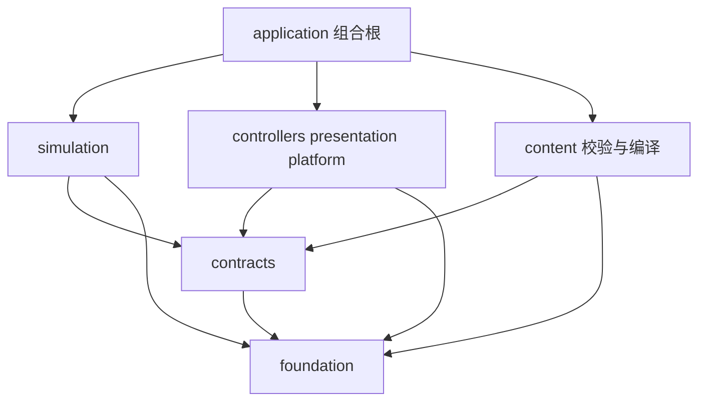
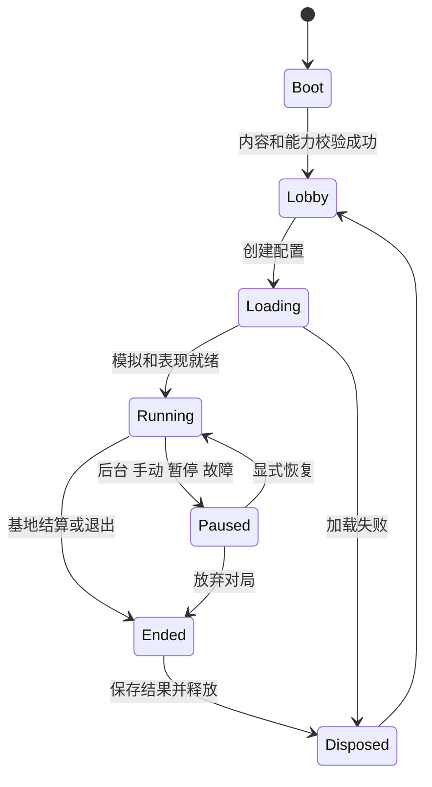

# Android HTML5 MOBA 技术架构

> 当前执行状态（2026-10-01）：M0 已结束，进入 M1。规则基线仍为 0.1.1，工程版本为 0.2.0；原有 M0 文句保留为制定时说明。当前实现与未完成项以 [M1_IMPLEMENTATION.md](M1_IMPLEMENTATION.md) 和 [M1_ACCEPTANCE.md](M1_ACCEPTANCE.md) 为准，后续阶段尚未实现。

版本：0.1.1。日期：2026-10-01。状态：M0 架构修订，尚未实现。

本项目面向 Android Chromium 横屏，使用 Phaser、TypeScript、Vite 和 HTML5/WebGL。最终目标是 5v5，玩家控制一名英雄，其余席位由 Bot 控制；先完成可持续扩展的单机游戏，再评估真人联网。本次只定义架构、接口责任与验收标准，不创建游戏系统、运行工程、美术或 Demo。文中的目录、接口和预算均为后续实现约束。

核心方案是独立的固定 Tick 模拟层、单向命令输入、明确顺序的事务结算和经过权威信息披露策略过滤的表现输出。空间视野是策略的重要证据，但不等于全部信息权限。Phaser 不保存权威战斗状态。未来联网可替换命令传输和状态来源，但仍需单独开发服务器、预测、校正与同步协议；本设计不声称单机工程天然具备联网能力。

关联规范：[战斗流水线](COMBAT_PIPELINE.md)、[编码规范](CODING_RULES.md)、[开发阶段](MILESTONES.md)、[性能预算](PERFORMANCE_BUDGET.md)。待定选择及依据保存在 [设计决策](../DESIGN_DECISIONS.md)，变更保存在 [变更记录](../CHANGELOG.md)。

## 1 系统边界

### 1.1 权威状态与职责

| 模块 | 拥有的数据及责任 | 不承担的责任 |
| --- | --- | --- |
| foundation | 有限数值、几何、排序、ID、可序列化随机数、通用集合 | 游戏规则、浏览器 API |
| contracts | 命令、事实、Effect 描述、组件数据、配置、快照和边界接口 | 状态写入、运行服务、依赖实现类 |
| content | 原始内容校验、跨文件引用校验、公式编译、生成只读 CompiledCatalog | 读取网络或磁盘、运行战斗、加载纹理 |
| simulation | 对局、实体、属性、战斗、地图规则、空间可见性、信息权限、经济与胜负的唯一权威 | DOM、Phaser、音频、存储、网络、Bot 决策 |
| controllers | 玩家意图转换、Bot 感知与决策、统一命令生成 | 直接修改世界、绕过视野或施法规则 |
| presentation | Phaser 场景、角色表现、UI、小地图、触屏捕获、音频和 VFX | 命中、伤害、位移终点、视野与购买是否成功的判定 |
| platform | 资源字节读取、IndexedDB、配置持久化、浏览器生命周期、能力探测、PWA 外壳 | 战斗数值、对局胜负、英雄逻辑 |
| application | 组合根、对局 Session、时钟驱动、控制器调度、投影交接、错误与暂停协调 | 把英雄特例或伤害公式写进启动器 |

每类状态有唯一逻辑写入者。其他模块通过只读查询、Command 或 Operation 请求变化。调度器拥有执行顺序，不借此获得任意修改组件的权力。

### 1.2 模拟层功能划分

| 功能域 | 拥有的权威数据 | 主要输入 | 主要结果与交互 |
| --- | --- | --- | --- |
| Entity Kernel | 槽位、generation、存在性、创建销毁队列 | Spawn/Despawn Operation | 实体句柄与组件存储；死亡不等于销毁 |
| Match | 队伍、席位、出生点、胜负状态、对局计时 | MatchConfig、基地死亡事实 | MatchEnded；结束后拒绝战斗命令 |
| Attributes | 基础值、成长、派生缓存和失效版本 | 等级、装备、Modifier 提供的贡献数据 | 最终属性；只读公式输入 |
| Actions | 普攻、技能、施法状态、冷却、充能、目标锁 | Attack/Cast/Cancel Command | 攻击释放、Effect 计划与投射物生成请求 |
| Status | Modifier 实例、Tag 来源、控制状态与持续时间 | Apply/Remove/Dispel Operation | 属性贡献、动作能力限制、Hook 描述 |
| Combat | 生命、护盾、生命层、伤害归因账本 | Damage/Heal/Shield Operation | 结算事实、死亡候选；不发放金币 |
| Resources | 法力及自定义资源池、预留量、再生状态 | Reserve/Spend/Gain Operation | 资源结果；供施法和伤害路由查询 |
| Movement | 权威位置、朝向、路径、冲刺与强制位移状态 | Move Command、Displacement Operation | 路径与位置结果；更新空间索引 |
| Projectiles | 逻辑投射物、寿命、轨迹、碰撞、穿透命中集合 | SpawnProjectile Operation | HitIntent、ProjectileEnded |
| Visibility | 队伍视野、空间显形、草丛关系、已探索区域 | 位置、遮挡、视野贡献、空间 Reveal 授权 | SpatialVisibilitySnapshot、目标选择证据；不决定全部消息权限 |
| Information | 披露授权、按席位事件、观察历史、最后已知信息 | 空间视野快照、事实、DisclosurePolicy、RevealPolicy、已验证 Ping | Observation/PerceptionEvent/可披露字段；不修改战斗命中或自行开放目标选择 |
| Map Rules | 波次、路线、野怪营地、塔仇恨、目标刷新 | Tick、伤害和死亡事实 | Spawn、Attack 意图、营地状态；不直接扣血 |
| Progression | 等级、经验、金币、击杀助攻、物品槽、商店交易 | DeathRecord、Reward Operation、Shop Command | 升级、奖励、装备贡献、交易结果 |
| Life | Alive/Dead、死亡编号、复活倒计时 | 致死结算、复活策略、Tick | DeathRecord、Respawn Operation；不重复记死亡 |

功能域是设计上的责任边界，早期不必每域独立 npm 包。模拟功能目录禁止互相导入实现：它们读取 Contracts 定义的投影，提交 Operation，由 simulation/runtime 注册的处理器串联。地图单位自动攻击属于低层规则；英雄 Bot 战术属于 controllers。兵线和塔可使用同样的 Action/Effect 执行能力，不另写一套伤害。

## 2 模块依赖与循环依赖约束

### 2.1 允许的直接导入

下表是完整允许清单。箭头表示“导入”，不是运行时数据方向；未列出的跨层导入一律禁止，包括仅类型导入。

| 导入方 | 可导入的项目模块 | 可用的外部能力 |
| --- | --- | --- |
| foundation | 无 | 标准语言和纯函数工具 |
| contracts | foundation | 纯类型、Schema 类型；无环境 API |
| content | contracts、foundation | 纯校验器；字节由外部传入 |
| simulation | contracts、foundation | 经锁定的纯计算工具；无 DOM/Phaser |
| controllers | contracts、foundation | 纯决策工具 |
| presentation | contracts、foundation | Phaser、受限 DOM 与输入/音频表现 API |
| platform | contracts、foundation | 浏览器 API、存储、加载、PWA |
| application | 上述全部模块 | Vite 入口环境；显式注入依赖 |
| tests、tools | 被检查模块的公开入口 | 测试与构建工具；不得被产品代码导入 |



Adapter 节点只是三组并列模块的图示集合，它们之间没有导入边。application 是唯一跨模块装配处。contracts 不导入各模块以“汇总所有类型”；领域边界类型直接定义在 contracts，避免倒置依赖。

模拟层内部直接导入白名单：kernel → contracts/foundation；shared → kernel/contracts/foundation；每个 features/* → shared/kernel/contracts/foundation 及本功能域内部文件；runtime → kernel/shared/features/contracts/foundation。kernel、shared、feature 均不得反向导入 runtime。shared 只能包含纯规则工具与只读查询辅助，不成为第二个组合根。

### 2.2 数据往返不等于导入往返

UI 生成 RawInput，application 转给 controllers 生成 Command，再交给 simulation。simulation 输出 Observation 和事实，application 再交给 UI。双方通过 contracts 交互，不能互相持有实现类。Bot 也通过同样入口工作。处理器注册表由 runtime 装配，feature 只能向事务收集器提交有类型的 Operation，不能取出另一个 feature 的对象调用。

重点禁止：Hero → Combat → Hero；Modifier → Attributes → Modifier；UI → Simulation → UI；AI → Map Rules → AI；Save → World → Save；Feature → Runtime → Feature。对应的替代方式分别是内容 ID 与注册能力、属性贡献快照、Command/Observation、感知 DTO、Checkpoint DTO、Operation 分发。

静态校验必须同时检查文件导入图的强连通分量、目录白名单和别名解析。依赖图无环只是第一道门；属性转换图、内容触发链、Effect 派生链也要单独验证。

## 3 数据流与边界接口

### 3.1 对局装配

platform 提供原始内容字节 → content 校验/编译 → CompiledCatalog → application 创建 Session 和 Simulation。MatchConfig 包含地图 ID、十个席位、控制者分配、随机种子、Ruleset ID、内容 hash 和 Tick 率。UI/音频/VFX 清单与逻辑清单分别校验，通过稳定 asset ID 对应；缺少装饰资源不改变逻辑结果，缺少必要内容则阻止开局。

### 3.2 每 Tick 输入与输出

1. application 将触屏 RawInput 交给 PlayerController；将上一完成 Tick 的 Perception 交给轮到执行的 Bot。
2. 控制器输出 Command。Session 为本地输入分配 controllerId、单调递增 sequence 和 targetTick，模拟层重做全部合法性检查。
3. simulation 按 [COMBAT_PIPELINE.md](COMBAT_PIPELINE.md) 执行，提交权威组件变更与不可变事实。
4. Visibility 输出空间可见性证据；Information 结合 DisclosurePolicy、RevealPolicy 和席位/队伍权限，生成每个席位的 Observation/Perception 及 PerceptionEvent。
5. application 把变化集与观察结果交给 presentation，并把完整 Checkpoint DTO 交给 platform 异步存储。

| 契约 | 必需字段与语义 |
| --- | --- |
| EntityRef | index、generation；存储与传输不携带对象引用 |
| Command | matchId、controllerId、sequence、targetTick、actorRef、kind、payload；不得携带“算好的伤害” |
| CommandResult | command key、accepted/rejected、reason、tick；重放和 UI 使用相同错误码 |
| Operation | opId、rootId、parentId、sourceRef、sourceOwnerRef、targetRef、type、tags、payload、深度与触发链 |
| DomainFact | eventId、tick、phase、causal IDs、只读结果；代表已提交事实 |
| DisclosurePolicy | recipient、eventType、source/targetDisclosure、positionPrecision、duration、audience/spatialScope、允许输出字段 |
| PerceptionEvent | 接收者授权后的事件类型、脱敏实体描述、位置/方向信息、observedTick/expiresTick、许可用途；没有原始事实指针 |
| RevealPolicy | 对指定队伍/席位的空间或字段授权、作用对象、覆盖隐身/草丛条件、持续时间、是否授予目标选择证据 |
| Observation | observer/team、tick、己方及授权敌方字段、历史位置、地图投影；没有 World 指针 |
| RenderDelta | 授权 created/changed/removed、运动样本、PerceptionEvent；补包可用完整 Observation |
| Checkpoint | formatVersion、engineVersion、rulesetVersion、contentHash、tick、RNG、模拟与控制器状态、待执行调度项 |

EntityRef 还须受 matchId/session 隔离，旧对局句柄不能访问新对局。完整 World、调试全图、原始 DomainFact 和 Checkpoint 不能泄漏给普通控制器或表现层。离开视野后默认停止当前实体状态流；独立授权只披露明确允许的字段/事件，不能把一次声音提示升级为完整单位快照。最后已知信息带 observedTick，不伪装为当前信息。

### 3.3 未来联网边界

现在只定义 CommandSink、ObservationSource、CheckpointCodec 这些 contracts 接口，不实现 socket、同步、锁步或 rollback。未来推荐先评估服务器权威快照方案：客户端提交意图，服务器验证并推进模拟，客户端插值与按需预测。不能让联网玩家提交伤害结果。跨设备确定性不由固定 Tick 自动保证，需专门评估数值表示、运行平台、序列化顺序和同步测试。

## 4 Entity 与组件设计

采用轻量 ECS 风格：实体是句柄，组件是数据，System 操作满足查询的实体集合。MVP 可用类型化稠密数组和索引表，不先引入复杂 ECS 框架，也不强求所有组件立即采用 SoA。等剖析证明瓶颈，再在不改变公开语义的前提下替换存储。

实体类别由 archetype/template 决定：英雄、兵、野怪、塔、基地、逻辑投射物、区域等。类别 Tag 用于过滤，不形成 Hero extends Sprite 的继承树。

| 组件族 | 示例数据 |
| --- | --- |
| Identity | templateId、teamId、ownerRef、killCreditOwnerRef、分类 Tag |
| Transform | position、previousPosition、facing、radius |
| Attributes | 基础属性、成长来源、修正贡献、派生缓存版本 |
| Vitality | 当前/最大生命、额外生命层、护盾实例集合 |
| Resources | resourceDefId 对应的当前值、上限、再生、预留 |
| Action State | 攻击阶段、施法阶段、技能等级、冷却、充能、取消策略 |
| Motion | 移动意图、路径、速度、位移模式和碰撞策略 |
| Status | Modifier 句柄、来源、层数、到期、Hook 注册、控制 Tag |
| Visibility | 视野贡献、显形/隐匿标记、草丛区域 ID |
| Progression | 经验、等级、金币、物品槽、交易序列号 |
| Life | alive/dead、deathId、respawnTick |
| Map Behavior | laneId、campId、仇恨记录、出生锚点 |

组件本身无 Phaser 对象、闭包、Promise、DOM 和计时器。System 不通过订阅 DOM 事件推进状态。技能和装备保存定义 ID 与实例参数，不复制大量只读定义。

新建实体在阶段屏障提交：在 P2 生成的逻辑投射物最早从本 Tick P4 开始移动；P5 生成的投射物在 P8 注册，最早下一 Tick P4 移动。销毁标记立刻使对象不能成为新目标，实际移除在 P8。遍历集合时不增删迭代数组；提交顺序以稳定 opId/EntityRef 排序。generation 在槽位复用时增长，溢出策略为退休槽位，不能让旧句柄重新有效。

英雄死亡保留实体与席位，切换 Life 状态并移除行动能力；复活重新设置指定组件与位置。死亡后已经释放的投射物是否继续、来源失效后如何归因，由 Effect 定义的 sourceLifetimePolicy 指定，默认释放后继续并保留施放时归因。

## 5 数据驱动和复杂机制扩展

### 5.1 内容管线

原始 JSON → Schema 校验 → ID/引用/范围校验 → 属性/触发图与披露权限检查 → 编译单位、公式和查询条件 → 联合 Ruleset CapacityCertificate → 冻结 CompiledCatalog → 每对局锁定 hash。容量证书同时证明目标扇出、Replacement/Hook/派生工作和所有生产者同 Tick 并发，具体不变量以 COMBAT_PIPELINE 第 6 节为准；未证明有限上界不得开局。禁止运行中随意改内容；开发热重载通过结束并重建测试 Session 生效，不偷偷修改正在进行的对局。

内容类别至少包括 heroes、abilities、modifiers、effects、resources、items、units、maps、rulesets、bots、disclosure/reveal policies、presentation manifests。英雄仅组合这些能力；当表达能力不足时，先增加可复用 Effect/Component/Hook，并附测试，再由英雄数据引用。

一个技能定义应明确：目标模式、射程/几何、资源成本、施法/引导/后摇时间、充能、冷却起算策略、中断/退款策略、Effect 顺序、目标关系、视野要求、来源快照策略、显示 ID。技能等级数据可用数组，不能由 UI 自行推算数值。

Modifier 定义明确：叠层键、最大层数、合并来源、覆盖规则、持续时间、周期首跳时间、属性贡献、Tag、控制类别、驱散类别、死亡清除策略、Hook 和表现 ID。实例时间一律转为 Tick；数据中的毫秒只在编译阶段转换一次。

Effect 使用有限的 discriminated union，例如 Damage、Heal、Shield、ResourceChange、ApplyModifier、Dispel、Displace、SpawnProjectile、SpawnArea、Conditional、Sequence、ChooseTarget。通用执行器分发 Operation；禁止给 JSON 放任意 JS 代码、eval 或英雄名称分支。允许复杂能力扩展包，但扩展仍只能依赖 contracts/foundation/shared，并由 runtime 注入受限查询与操作接口。

### 5.2 属性与公式

属性流水线的规范次序：Base + Growth + Flat → 加法百分比贡献 → 乘法贡献按稳定顺序 → 转换贡献 → Clamp。转换贡献形成显式有向无环图；源属性取转换前或已拓扑完成值，必须在定义声明，禁止“攻击力转护甲再护甲转攻击力”迭代求平衡。

统一 FormulaRegistry 保存伤害、抗性、穿透、急速、经验、金币、控制时间和资源路由公式。内容使用 formulaId 或受限表达式 AST，只允许白名单运算、读取指定属性、有限条件分支；编译校验量纲、除零、有限数值、节点数与循环。表现层收到最终可显示值和 breakdown，不导入战斗公式。

装备槽数、攻速上限、穿透叠加、史诗目标上限、护盾交互、临时生命和自定义资源均归 Ruleset 或明确的通用机制。不会默认把原创英雄稿中的所有规则等同于本游戏最终规则；数值确定须另作设计决策。

### 5.3 通用能力示例

正面格挡可由 facing + DirectionPredicate + DamageRoute 表达；受伤转自定义资源消耗可由 ResourceRoute 表达；多形态使用 FormState 与能力集合切换；条件治疗转护盾使用计量 Modifier 与阈值 Hook；连段使用阶段化 Action 状态机。它们都是待实现的表达方案，本阶段不提前实现任何英雄。

## 6 生命周期

### 6.1 应用与 Session



PauseReason 是集合，例如 user、hidden、orientation、contextLost、overload、fault；清除一种原因不能覆盖其他原因。只在 Tick 屏障进入暂停/结束，正在执行的事务不被半途保存。竖屏时覆盖提示并暂停单机对局；旋转不重建 World，尺寸改变只重算表现布局。

后台、锁屏和浏览器冻结：停止推进 Tick，清除触屏按住状态，暂停音频，保存最近一个完整边界 Checkpoint。页面可能被系统直接终止，不能依赖 beforeunload/最后一次保存；需周期性检查点。恢复清空 wall-clock accumulator、重设时钟基准，不补算后台时间，先显示恢复按钮。WebGL context 丢失仅重建表现资源；World 保留或从兼容检查点恢复。

释放顺序：停止输入与时钟 → 取消控制器异步任务 → 停止输出投递 → 完成或取消持久化任务 → 释放场景/音频/纹理 → dispose Session 与监听器。每项销毁须幂等，迟到的异步结果用 session token 忽略；新对局不能复用旧订阅。

### 6.2 状态对象

| 对象 | 生命周期与边界规则 |
| --- | --- |
| Modifier | Created → Active → Removed/Expired；Tag 来源和 Hook 同时注销；移除幂等 |
| Ability | Ready → Windup/Channel → Released → Recovery；中断策略决定资源、冷却和充能 |
| Projectile | Spawned → Flying → Hit/Expired/Cancelled；每目标命中集合和来源快照可存档 |
| Area | Spawned → Active → Expired；进入/离开按权威几何检查，支持死亡和传送导致离开 |
| Shield | 授予 → 吸收/刷新 → 耗尽/过期/驱散；吸收顺序和破裂事实明确 |
| Resource Reservation | Reserved → Committed/Released；任何取消、死亡、退出都释放未提交预留 |
| Entity | Allocated → Active → PendingDespawn → Removed；死亡英雄仍处于 Active |
| Match | Created → Running/Paused → Ended → Disposed；Ended 之后无奖励二次结算 |

## 7 Tick 与 Game Loop

### 7.1 时钟方案

30 Hz 是首选默认候选和当前实现基线，最终 Tick 率尚未验证，必须经 M1/M3 响应、CPU 与热态探针决策。Session 锁定 tickRate，step = 1000/tickRate ms，权威时间为整数 tickIndex；30 Hz 的一步约 33.3 ms。渲染目标 60 FPS，低画质可 30 FPS，但不在同一对局动态改变模拟率。时间转换用 ceil(durationMs × tickRate / 1000)，瞬发可为 0，持续状态通常至少 1 Tick。全部冷却、控制、刷新、复活与再生依赖 Tick，不用动画/浏览器计时器。

application 接受由表现外壳驱动的每帧单调时钟脉冲，使用未平滑的实际 elapsed 维护 accumulator。Phaser 的平滑 delta 不能成为模拟时间源。时钟抽象可在 headless 测试中手动推进，不需要启动 Phaser。只有一个时钟驱动入口，不能同时启动第二个 requestAnimationFrame/setInterval 模拟循环。

一帧最多推进 4 个 Tick，最多接收 250 ms 前台 elapsed。执行后若仍有整 Tick 积压，进入 overload 暂停，记录积压，清空恢复基准并提示恢复；不跳 tickIndex、不放大 dt、不持续补算。超过 250 ms 的前台间隔也按 overload 处理，避免悄悄丢弃时间。允许主动降低表现画质，但不得减少战斗结算次数。此方案接受单机严重卡顿时暂停，联网以后必须另定义追赶和校正策略。

探针 A 保留 previous/current Transform 插值，alpha = accumulator/step；常规插值可能额外引入接近一个 Tick 的显示延迟，不能仅据平均 FPS 判断触屏手感。传送/复活/瞬间位移带 discontinuity，不穿墙插值；血量、伤害、控制和结果只用已提交数据。高渲染帧率不能使攻击变快或控制少结算。

探针 B 允许表现侧立即更新摇杆、按钮高亮、瞄准线和取消提示，并评估仅本地玩家视觉代理的安全短时移动预测。VisualProxy 与 World Transform 分离，只读授权快照、本地意图与公开地图；不读取隐藏单位/草丛信息来改善预测，不影响命中、投射物、空间索引、视野、Bot、冷却、资源、RNG 或事实。首次候选预测窗口不超过一个 simulation step，并在下一权威样本纠正；拒绝命令、控制、死亡、传送和失焦立即取消预测。不能把技能释放反馈伪装成已经命中/施法成功。

### 7.2 每 Tick 阶段

P0 时间和到期 → P1 命令入口 → P2 动作 → P3 移动 → P4 空间/视野/碰撞 → P5 Effect 事务 → P6 死亡/奖励 → P7 收尾可见性 → P8 结构提交 → P9 对外快照。每阶段精确行为、同 Tick Tie-break、Hook 调度、额外屏障见 [战斗流水线](COMBAT_PIPELINE.md)，此文不另维护第二份结算顺序。

### 7.3 不同频率任务

| 工作 | 频率与保证 |
| --- | --- |
| 移动、投射物、伤害、控制到期、技能阶段 | 每个 simulation Tick；当前 30 Hz 基线 |
| 视野裁定、目标可选性 | 每 Tick；事件造成的位置/显形变化在事务屏障局部更新 |
| Bot 战术决策 | 每 200 ms 按 tickRate 转换，30 Hz 下每 6 Tick；席位错峰、授权感知输入 |
| Bot 局部目标选择 | 每 100 ms 转换，30 Hz 下每 3 Tick；动作执行仍每 simulation Tick |
| 路径搜索 | 固定每 Tick 工作额度；增量、稳定优先级，不按耗时决定逻辑输出 |
| UI 文本和小地图视觉重绘 | 最多 10 Hz；死亡、危险预警与操作确认可立即刷新 |
| Checkpoint 复制 | 默认每 10 秒转换，30 Hz 下 300 Tick，完整边界；写入异步 |
| 性能采样 | 低频采样；详细 tracing 只在调试会话开启 |

工作频率及路径预算在对局开始锁定；不能按当前 FPS 动态改变 Bot 反应，造成不同性能设备上不同战斗结果。

### 7.4 Tick 率与触屏响应探针

后续 M1/M3 比较 A：30 Hz Simulation + 60 Hz Rendering + 当前插值；B：30 Hz Simulation + 60 Hz Rendering + 非权威即时反馈/安全表现预测；C：必要时作为对照的 60 Hz Simulation + 60 Hz Rendering。C 的插值/即时反馈配置要显式记录，和对应 A/B 配对，避免同时改多项却把收益全归 Tick 率。当前不建立探针工程，仍停 M0。

M1 验证 A/B 的输入到 UI、视觉移动和权威移动延迟及空外壳成本；如响应门槛不达标或成本/精度对照有必要，加入 C。M3 在碰墙、控制、中断和技能按下/拖动/释放场景复测，再决定是否用于大量英雄/内容实现。初始测量门槛、设备、CPU/电量/热量方法见 PERFORMANCE_BUDGET 第 3.3 节；未实测的门槛只是待验证目标。

若保留 30 Hz，ADR 003 必须记录设备与浏览器、A/B/C 结果、触屏手感为何可接受、采用的反馈/预测方式和纠正误差；若证据不完整，只保留 provisional baseline，不标记最终 Tick 率已接受。改率需新 Session/版本及内容时间、容量证书和存档复审。同率不同渲染帧率用相同命令流核对 hash；30/60 Hz 对照按真实时间、数值不变量和声明量化容差比较，不能要求不同离散步长逐 Tick hash 相等。

## 8 Event Hook 与 Operation

将四类权威通道明确分开：Command 请求玩家行为；Operation 是内部可执行的状态变更描述；Hook 是事务内受限的规则扩展；DomainFact 是已发生结果。Information 将事实转换为授权 PerceptionEvent，表现与 Bot 不接收原始事实，不能取消事实或回写状态。

权威 EventQueue 是 Session 私有、强类型、同步、分阶段、稳定排序的队列。不是全局 EventEmitter，也不是任意发布订阅调用栈。权威处理器在启动时注册，注销归 Session/Modifier 生命周期；监听器顺序由 stage、priority、definitionId、instanceId 确定，不由注册偶然顺序确定。

Pre Hook 返回受限 Patch、Cancel 或 Replacement，不直接写组件；Post Hook 只能生成派生 Operation。Context 提供声明的只读查询和因果信息。禁止 Promise、随机环境数据和直接调用 anotherSystem.update。传播深度、总数、重复触发键和非法阶段在 [战斗流水线](COMBAT_PIPELINE.md) 中约束。

事实用于伤害浮字、塔仇恨、击杀记录等，但权威消费者只在规定屏障执行。塔在 P6 更新仇恨，最早下 Tick P2 改变攻击；金币和等级在 P6 结算。UI 可以漏掉一次装饰动画，权威队列不能漏掉一次结算。表现订阅异常由 application 隔离；权威异常停止 Session，不能 catch 后继续运行损坏状态。

## 9 地图 视野 AI 和移动端

地图逻辑数据包含可行走层、静态碰撞、草丛多边形、视野遮挡、路线、出生点、营地、塔/基地和商店区域。地图渲染切片由表现清单管理。空间索引默认均匀网格，静态与动态分开；寻路使用导航网格/栅格和增量 A* 的候选方案，算法在 M1 性能探针后确定。寻路不能使用画面像素或 Sprite 碰撞。

### 9.1 空间可见性与信息披露

Visibility 保留未探索/已探索不可见/当前可见、共享空间视野、草丛和隐身遮蔽及目标选择证据。普通单位锁定要求相应可见/显形和 TargetingPolicy；已经释放投射物的失去视野行为仍由技能定义。它不决定所有声音、播报和 Ping 是否存在。

Information 是独立权威功能域，输入为 runtime 提供的 SpatialVisibilitySnapshot、只读事实与数据策略；不导入 Visibility、Actions 等实现。披露规则由 content 编译为 contracts DTO，simulation/runtime 装配。输出按接收者生成字段许可投影，再由 application 交给 Bot/UI/音频/小地图。这样不会增加 feature 间导入环。

### 9.2 DisclosurePolicy 和 PerceptionEvent

| 策略字段 | 必须表达的语义 |
| --- | --- |
| recipient | 席位/队伍/友军/敌军/所有参与者/听觉距离条件等选择器；观察权限另作明确配置 |
| eventType | 技能声、技能预警、击杀/目标播报、Ping、观察更新等语义，不开放任意原始事实 |
| sourceDisclosure | none、匿名类别、身份，以及允许的 source 字段白名单；身份不自动授予当前坐标 |
| targetDisclosure | none、匿名、身份及字段白名单，独立于 source；禁止顺带披露隐藏目标血量 |
| positionPrecision | none、相对方向扇区、命名区域、量化单元、精确点；分别指定 source/target/event anchor |
| duration | instantaneous 或有限 durationTicks，observedTick/expiresTick；过期不继续更新 |
| scope | audience 为 private/team/public；spatialScope 为 local/global，表示消息覆盖，不表示全图视野 |
| permittedUses | 可播放音频、绘制标记/预警、进入 Bot 记忆等用途；不能升级已有字段精度 |

公开事件使用脱敏 publicEventId。未授权源/目标时去掉 EntityRef、owner、原始 root/parent ID、精确方位音频参数和可关联的私有元数据；方向提示只发送量化方向，不能携带藏起来的精确坐标供 UI 使用。技能/事件类别本身允许玩家推断的内容也需政策声明，不能只删 sourceId 就称完全匿名。

PerceptionEvent 包含已允许的事件类型、身份描述、位置/方向、观察时刻、有效期和许可用途，不含可供接收端查询 World 的句柄。内部 policy/provenance 审计证据留在调试域，外发说明也遵守字段许可。信息精度有偏序，组合授权明确处理：已有合法精确观察可保留其历史，粗提示本身不能更新成精确当前坐标。历史记录属于 Information，地图探索位图仍属于 Visibility。

事件的听距/方向/发生位置与空间证据在发生屏障捕获，Information 按发生时权限投影；当前单位状态则按 P9 的当前权限过滤，不能因事件被允许而继续跟踪。有限授权采用 [startTick,endTick)，P0 先到期；瞬时消息在当前输出屏障只投递一次，不因 duration=0 被误删，也不形成持续授权。撤销或死亡对未投递消息的策略显式声明，不把旧事件位置当现位置。保存/恢复保留 observedTick/expiresTick 与去重，不能重放消息延长授权。

### 9.3 RevealPolicy 与规则示例

RevealPolicy 区分空间显形和仅信息授权。空间显形通过受限 Operation 交给 Visibility，指定队伍、对象、持续时间、是否穿草丛/隐身及目标选择证据；只披露身份或声响的授权留在 Information，不改变 Targetable。特殊技能主动暴露自己可以选择一种或两种，不自动授予全部属性。

| 情况 | 合法输出示例 | 不自动获得的权限 |
| --- | --- | --- |
| 隐藏施法者发出可听技能 | 指定听众得到匿名技能声或方向扇区 | 施法者精确坐标、生命、可选目标 |
| 全局技能预警 | public/global 的危险区域或准许的预警位置 | 隐藏施法者/被瞄准单位完整状态 |
| 击杀/目标播报 | public/global 的允许名称与事件结果 | 来源当前位置、隐藏伤害全过程 |
| 队伍 Ping | team 的玩家标注点/方向及允许 Ping 类型 | 对隐藏敌人的实时跟踪；隐藏目标句柄请求应拒绝 |
| 只知事件发生 | 事件类型与时间，source/target/position 为 none | 因果 ID、来源身份与方向 |
| 最后位置/队友共享 | 带 observedTick 的历史点，或队友合法观察的授权合并 | 敌人离开视野后的连续实时位置 |
| 主动显形/隐身/草丛 | 按 RevealPolicy 授予字段或空间显形，持续时间明确 | 由单一“可听”标记解除全部隐身 |

默认不可见敌人停止状态流；允许的独立披露不算越权，超白名单字段才是泄漏。Bot 接收和该席位玩家相同的信息权限过滤结果，可以基于方向/历史进行推断，但不能读取原始 World、DomainFact 或内部证据来补齐精确隐藏状态。UI、音频和小地图只执行收到的许可，不各自决定信息权限。队伍分享只能分享原本有权知道的信息，不能形成授权放大循环。

### 9.4 移动端输入与表现

玩家输入为多指触屏：左摇杆、普攻键、技能拖拽瞄准/取消区、锁定目标、回城、商店、小地图交互。RawInput 使用 pointerId、begin/move/end/cancel 和屏幕空间样本，Controller 在摄像机/布局投影后生成世界意图。失焦、旋转、pointercancel 和 overlay 打开时清除按住状态；释放按钮不能重复施法。命令采样与去重按 Tick 完成。

Canvas 管理战场和实时 HUD，DOM 可承载菜单/设置/可访问说明；实时 HUD 不建立每单位一个 DOM 节点。screen/CSS/backbuffer/world 四种坐标独立命名，逻辑地图与画面比例无关。适配 16:9 到 22:9 以及安全区域；不得依赖横屏锁定、全屏成功或物理键盘。音频在用户手势后解锁，解锁失败仅影响音频；语义危险预警必须有视觉反馈。

## 10 存档 配置与版本

### 10.1 数据分类

| 数据 | 保存位置与策略 | 兼容规则 |
| --- | --- | --- |
| 用户设置 | IndexedDB settings store；小型启动偏好可冗余到 localStorage | 独立 settingsVersion；缺失项用默认值 |
| 单机 Checkpoint | IndexedDB checkpoints store，current/previous 两份 | 完整 schema 校验、校验和、严格内容兼容 |
| 回放 | 初始配置、种子、已接受命令、阶段版本、校验 hash | 初期只承诺同引擎/内容版本重放 |
| 对局结果 | IndexedDB results store | 独立结果 Schema；不可据此恢复世界 |
| 静态内容与资源 | 构建产物；后期 Cache API 分版本缓存 | contentHash/assetHash；不与存档混用 |
| Debug 导出 | 用户主动导出的 JSON/压缩报告 | 标注版本和作弊标记，不自动上传 |

Checkpoint 必须包含逻辑投射物、命中集合、Modifier 状态、资源预留、动作阶段及攻击时间余数、死亡/奖励去重 ID、伤害/助攻账本、RNG 子流、未来调度任务、Bot 内部记忆、命令 sequence 与队列、op/event ID 计数器、增量寻路进度/队列、实体 generation、区域进入/离开状态、视野探索、Information 授权/期限/观察历史和待披露事件去重。保存 tickRate 与 CapacityCertificate 标识，恢复时验证兼容；当前 Tick 工作计数在下 Tick 重置，延迟根的生产者状态须保留。派生属性/空间索引可重建但结果一致。事务和事实队列边界耗尽，无法持久化的闭包不能入队。帧 accumulator、VisualProxy/预测轨迹、Sprite、纹理、音频节点和装饰粒子不入存档。

simulation 只导出自身 SimulationCheckpoint；application 在同一个完成边界、下个 Tick 开始前聚合控制器记忆、命令入口和 Session 配置。Checkpoint 复制是低频的外层边界任务，单独计时，不在 P9 中每 Tick 复制完整世界。恢复后玩家按住输入重置为中性，只保留已进入命令队列的未来意图；Bot 与模拟逻辑状态完整恢复。

异步保存先复制一个不可变完整边界 DTO，再编码/写入，不能跨 Tick 从 live World 拼接。IndexedDB 事务原子提交 metadata 与 payload；完成后再显示“已保存”。单 Session 保留一个写任务，后续定时请求合并到最新边界，手动保存有明确完成结果。当前损坏则尝试 previous；两者失败保留原文件并提供新对局选择，不静默覆盖。

结构迁移使用纯 version-to-version 函数并有 fixtures；MVP 对局存档要求 engineVersion、rulesetVersion 和 contentHash 完全兼容，不自动把旧英雄数值套进新规则。设置和历史结果可独立迁移。导入文件验证大小、Schema、版本与有限数值；不执行文件中的脚本。设备存储可能被清理，提供导出/导入，不把缓存当可靠备份。

### 10.2 PWA 与发布

后期提供 manifest、横屏倾向、离线资源清单、版本缓存和更新提示。Service Worker 只缓存/交付资源，不能充当后台模拟线程。正在运行的 Session 固定内容版本；新版本先完成缓存，再在大厅切换，不在战斗中 skipWaiting 替换代码或清除当前资源。静态资源与存档分别管理，清缓存不能删存档。

正式输出为 Vite 的 HTML、JS、JSON 和资源目录，通过 HTTPS 或受支持的本地开发服务运行；“HTML5”不要求把整个游戏塞进一个 HTML 文件，也不把 file:// 作为正式运行方式。

## 11 Debug 与自动测试

Debug 面板分为只读观察与显式作弊命令：Tick 单步、暂停、实体/公式/状态/动作、AI/导航/视野/碰撞；新增容量 actual/certificate/limit、生产者与派生链、Disclosure 接收者/字段/精度/到期的内部审计、touch 各阶段延迟和 VisualProxy 纠正。内部审计权限不能混入玩家输出。作弊走 DebugCommand 并标记 replay，发布默认关闭。日志为有界环形缓冲，含 match/tick/phase/root/parent/entity，禁止无限日志。

测试组合：纯公式/属性性质测试；headless 阶段测试；联合容量证书与合法最大扇出/并发测试；信息披露字段/精度/期限/接收者矩阵；依赖检测；同率命令回放与恢复 hash；Bot 仅接收授权感知；预测不写 World 的等价性；M1/M3 Android 响应/CPU/电量/热态探针。规则测试不依赖绘图，设备相关结论由真机数据支持。

进一步的测试目录、必要用例、门禁命令与验收分布见 [编码规范](CODING_RULES.md) 和 [开发阶段](MILESTONES.md)。本次只检查文档结构、链接、清单、依赖 DAG 与跨文档一致性；没有可运行的 TypeScript 或 Vite 工程，不能报告编译/游戏测试通过。

## 12 计划文件目录

以下是后续工程的目标路径清单，不表示本次已经创建源文件。路径按责任划分，避免按“英雄一”“英雄二”复制完整系统。

```text
src/main.ts                         Vite 入口 只调用 application
src/foundation/                     纯数学 ID RNG 集合
src/contracts/commands/             命令与拒绝码
src/contracts/components/           组件数据类型
src/contracts/content/              内容 Schema 和 CompiledCatalog DTO
src/contracts/events/               Operation Hook DomainFact
src/contracts/observations/         玩家 Bot 表现投影
src/contracts/disclosure/           披露 显形 感知事件与权限 DTO
src/contracts/persistence/          Checkpoint 设置 回放 Schema
src/contracts/ports/                跨模块边界接口
src/content/validation/             原始内容和跨引用验证
src/content/compiler/               公式和内容编译
src/simulation/kernel/              World 存储 队列 Tick 结构屏障
src/simulation/shared/formulas/     FormulaRegistry 纯数值规则
src/simulation/shared/queries/      受限只读查询
src/simulation/features/attributes/
src/simulation/features/actions/
src/simulation/features/status/
src/simulation/features/combat/
src/simulation/features/resources/
src/simulation/features/movement/
src/simulation/features/projectiles/
src/simulation/features/visibility/
src/simulation/features/information/
src/simulation/features/map-rules/
src/simulation/features/progression/
src/simulation/features/life/
src/simulation/features/match/
src/simulation/runtime/             固定阶段调度 Operation 分发和注册
src/controllers/player/
src/controllers/bot/
src/presentation/phaser/scenes/
src/presentation/phaser/entities/
src/presentation/ui/
src/presentation/input/
src/presentation/audio/
src/presentation/vfx/
src/platform/storage/
src/platform/assets/
src/platform/browser/
src/platform/pwa/
src/application/session/
src/application/composition/
src/application/debug/
content/heroes/                     纯逻辑 JSON
content/abilities/
content/modifiers/
content/effects/
content/resources/
content/items/
content/units/
content/maps/
content/rulesets/
content/bots/
content/disclosure/                DisclosurePolicy RevealPolicy
content/presentation/               逻辑 ID 到资源 ID 的清单
public/assets/generated/           原创生成素材
public/assets/third-party/         已核实许可证素材
tests/unit/
tests/property/
tests/simulation/
tests/content/
tests/replay/
tests/persistence/
tests/architecture/
tests/browser/
tests/performance/
tests/fixtures/
tools/                             校验 打包 性能报告
docs/ARCHITECTURE.md
docs/COMBAT_PIPELINE.md
docs/CODING_RULES.md
docs/MILESTONES.md
docs/PERFORMANCE_BUDGET.md
DESIGN_DECISIONS.md
CHANGELOG.md
ASSET_LICENSES.md                   引入资源时创建
package.json                       M1 才创建
tsconfig.json                      M1 才创建
vite.config.ts                     M1 才创建
index.html                         M1 才创建
```

各模块仅提供最小公开入口，不把所有内部文件导出到大型 barrel。逻辑测试使用 simulation 公开 Session 接口；仅专门的白盒测试可访问内部路径，产品模块不得借用测试 helper。

## 13 架构核查与当前限制

基线依赖按 foundation → contracts → 并列业务/适配模块 → application 的层级组成 DAG。模拟内部按 kernel → shared → feature → runtime 组成 DAG；所有允许导入均指向更低层，feature 之间无边。该结论是规范图检查结果，未来必须对真实 TypeScript 导入图执行检测。

系统覆盖核查：英雄/属性/攻击/技能/状态/控制由 Attributes、Actions、Status 管理；伤害/治疗/护盾/资源由 Combat、Resources 管理；移动/位移/投射物由 Movement、Projectiles 管理；空间视野/迷雾/草丛由 Visibility 管理，披露/感知权限由 Information 管理；兵线/野怪/塔/基地由 Map Rules、Match 管理；等级/经验/金币/装备/商店/击杀/助攻由 Progression 管理；死亡/复活由 Life 管理；AI 由 Controllers 管理；小地图/触屏/UI/音频/VFX 由 Presentation 管理。所有类别都有权威所有者和对外边界。

未解决项：具体 Phaser/TypeScript/Vite 版本、最低机型、地图尺寸、正式战斗数值、视野遮挡精度、寻路结构、完整玩家瞄准体验以及未来联网模式，均在 [DESIGN_DECISIONS.md](../DESIGN_DECISIONS.md) 标记；不会将候选选择写成已验证事实。

## 14 已核实的平台资料

以下资料用于平台约束核实，查询日期 2026-10-01；架构数值与阶段规则是本项目的设计决定。

- [Phaser TimeStep 官方文档](https://docs.phaser.io/api-documentation/class/core-timestep)：区分平滑 delta 与实际 elapsed，并说明浏览器可能暂停循环；实施时以锁定版本的 API 为准。
- [MDN Page Visibility API](https://developer.mozilla.org/en-US/docs/Web/API/Page_Visibility_API)：页面可见性变化及后台调度限制。
- [MDN Pointer Events](https://developer.mozilla.org/en-US/docs/Web/API/Pointer_events)：多指 pointerId 和取消事件，触屏适配需处理完整生命周期。
- [MDN 存储配额与清理](https://developer.mozilla.org/en-US/docs/Web/API/Storage_API/Storage_quotas_and_eviction_criteria)：持久化请求不能作为绝对备份保证。
- [MDN Service Worker API](https://developer.mozilla.org/en-US/docs/Web/API/Service_Worker_API)：安全上下文与生命周期；离线外壳不能保证对局在后台持续模拟。
